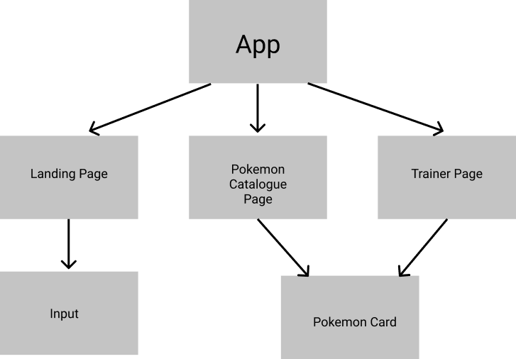

# Pokemon Trainer

This project was created in association with Noroff Accelerate program.

Pokemon Trainer is a web application for browsing and catching pokemon based on the Angular framework.

You can test the app [here](https://pokemon-trainer-noroff-2021.herokuapp.com/landing-page)

## About

The app is divided into 3 pages: Landing-page, pokemon-catalogue and trainer-page.

The app utilizes 2 apis for data storage and collection.

## APIs

The app uses a JSON server to keep track of registered users and their pokemon. Check it out [here](https://noroff-api-oddalm.herokuapp.com)

For data collection the app utializes the [Pokemon API](https://pokeapi.co)

## Landing Page

On the landing pagethe user is presented with a login form. Here the user can log in and register for the app.

## Pokemon Catalogue

The pokemon catalogue page displays 20 pokemon at a time. The pokemon have color according to their typing, as well as their individual stats.

To catch a pokemon, the user simply clicks on the card they want. A pokeball will appear on caught pokemon.

To view more pokemon, click on the 'next' button, and you will be presented with 20 new pokemon.

Click on 'Back to Start' to get back to the initial 20 pokemon.

The navbar updates with a profile banner when the user logs in. Click on this to get to the trainer page.

## Trainer Page

The trainer page displays the logged in users caught pokemon.

Each pokemon card has a 'release' button. Click this to release the pokemon.

You can click on 'Back to Catalogue' to get back to catching more pokemon.

The Logout button will remove the logged in user from session and redirect back to the landing page.

## Component Tree

## Running the app locally

To run the app locally run `npm install` and then run `ng serve` in the root directory.

Make sure to have the Angular CLI installed.
